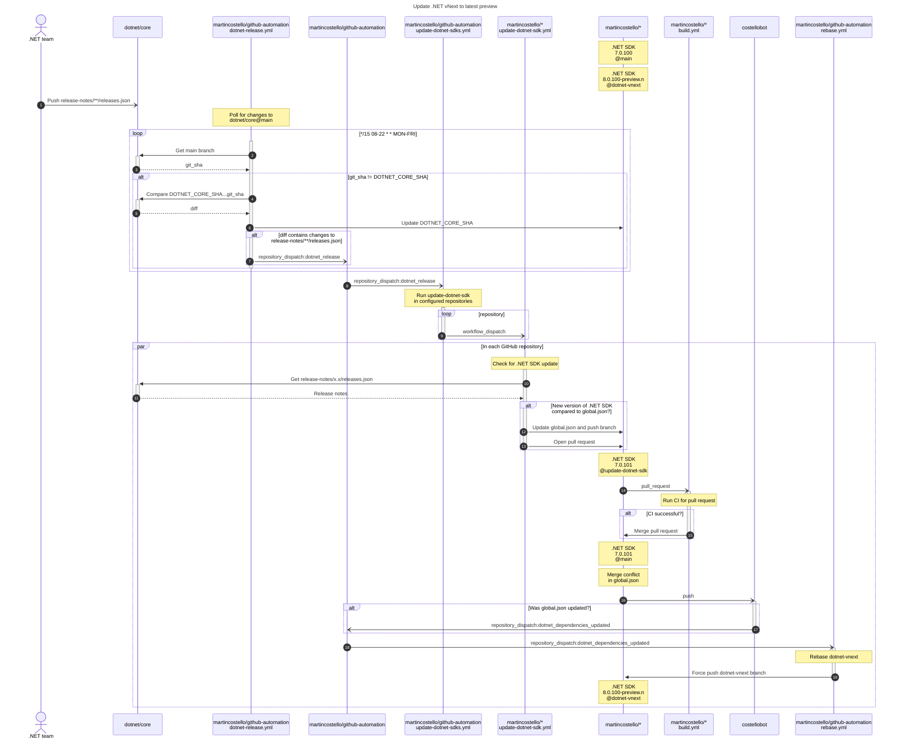

# Testing .NET vNext

> :warning: This guide is still a work in progress.

The workflows in this repository are used to help make it easier to
test .NET applications in GitHub repositories with the latest previews
of the next major version of .NET.

## Conventions

- The changes are tested in a branch named `dotnet-vnext`.
- The application code has already applied one manual update to the test .NET SDK version and has updated package references, Target Framework Monikers etc. to use that version.
- A draft pull request has been opened to merge the `dotnext-vnext` into the default branch.
- A `global.json` file that specifies the .NET SDK version to use is present in the root of the repository.
- Branch protections are enabled on the `dotnext-vnext` branch to:
  - Require a pull request
  - Require the same status checks to pass as the default branch
  - Allow force pushes to that branch from the users/apps that are used to update the branch
  - If the account used to force push the changes is not an owner of the repositories being updated, then you will need to assign the app/user (or a the team it belongs to) a custom repository role that has the _Bypass branch protections_ permission in addition to write access.
- The `dotnext-vnext` branch contains a GitHub Actions workflow named `update-dotnet-sdk`
- The only files in the repository containing versions that need updating regularly are:
  - `global.json`
  - `.csproj` files
  - `package.json` files

## Updating to a new .NET vNext preview

- Run [`update-dotnet-sdks`][update-dotnet-sdks] for the `main` branch on Patch Tuesday.
- Wait for any pull requests generated by the workflow(s) to be merged.
- Run [`rebase`][rebase] for the `dotnet-vnext` branch.
- Check whether any repositories require manual rebasing.
  - If so, you can use [Rebaser][rebaser] to simplify this.
- Run `update-dotnet-sdks` for the `dotnet-vnext` branch.

## Reporting on upgrades

The [`dotnet-upgrade-report`][dotnet-upgrade-report] workflow can be used to
generate a report of the .NET SDK versions used in the repositories configured
in the workflow. This will show a link to the upgrade pull requests, the SDK
version used in the `dotnet-vnext` branch, the status of the build and whether there
are any conflicts that need resolving in order to merge to the default branch.

## Sequence Diagram

[dotnet-upgrade-report]: https://github.com/martincostello/github-automation/actions/workflows/dotnet-upgrade-report.yml
[rebase]: https://github.com/martincostello/github-automation/actions/workflows/rebase.yml
[rebaser]: ./../README.md#manually-rebasing
[update-dotnet-sdks]: https://github.com/martincostello/github-automation/actions/workflows/update-dotnet-sdks.yml
